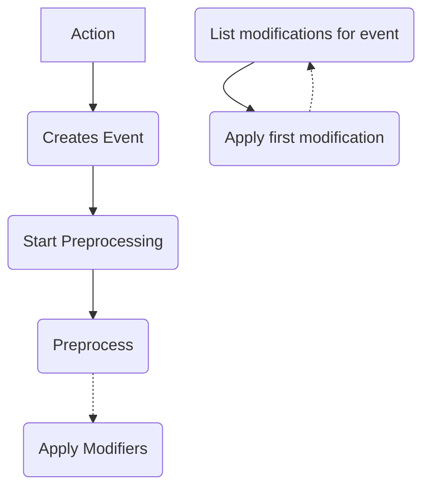

# Glossary

Action - A direct combat turn choice taken by a character

Effect - something on a character, item, stage/map, or anything else that causes
or modifies events

Event - A pending game state change that flows through the pipeline before being
applied

Modification - a change to an event, can be conditional or limited in some other
way.

Event Modifier? Meta event? (wip) - A modification to an event

- Pull event into pipeline
- Preprocess (create event and add initial modifications to mod pipeline)
- Process modification pipeline
  - For each mod
    - Apply to event
    - Emit "modified" event to mods pipeline
    - Check reactions to modified event, adding to pipeline as needed

# Pipeline Layout

## Events 
- flow through a pipeline
- created when a character takes an action or in response to a trigger from
either an action or a state change
  - when I am attacked
  - when a friendly unit takes a certain type of damage
  - when my turn ends
- have flags
  - ! can use these flags to not react to reactions !

## Modifications to events 
- *are checked only once* and do not chain
- have their own pipeline

## Pipeline
- phases
  1. Preprocess - allow effects to modify the event (incl cancel)
  2. Validate (isCanceled) - remove/stop event if no longer valid
  3. Occur - apply game state changes
  4. Respond - proc other effects

# Code Architecture

## Factories

Factories are functions that take parameters and create effects of the given
type

